<div align="center">
  <h1 style="text-align: center;font-weight: bold">Praktikum 4<br>Praktek Sistem Operasi</h1>
  <h4 style="text-align: center;">Dosen Pengampu : Dr. Ferry Astika Saputra, S.T., M.Sc.</h4>
</div>
<br />
<div align="center">
  
  <h3 style="text-align: center;">Disusun Oleh :</h3>
  <p style="text-align: center;">
    <strong>Calvin Raditya Sandy Winarto (3123500009)</strong><br>
    <strong>Zada Devi Mariama (3123500015)</strong>
  </p>

<h3 style="text-align: center;line-height: 1.5">Politeknik Elektronika Negeri Surabaya<br>Departemen Teknik Informatika Dan Komputer<br>Program Studi Teknik Informatika<br>2024/2025</h3>
  <hr>
</div>

# Operasi Input Output
Referensi : [Shell Programming](https://www.geeksforgeeks.org/introduction-linux-shell-shell-scripting/?ref=shm_)
## POKOK BAHASAN:
```
* Pipeline
* Redirection
```
## TUJUAN PEMBELAJARAN:
Setelah mempelajari materi dalam bab ini, mahasiswa diharapkan mampu:
* Memahami konsep proses I/O dan redirection
* Memahami standar input, output dan error
* Menggunakan notasi output, append dan here document
* Memahami konsep *PIPE* dan filter
  
## DASAR TEORI:

### 1. PROSES I/O
Sebuah proses memerlukan Input dan Output. Instruksi (command) yang diberikan pada Linux melalui Shell disebut sebagai eksekusi program yang selanjutnya disebut proses. Setiap kali instruksi diberikan, maka Linux kernel akan menciptakan sebuah proses dengan memberikan nomor PID (Process Identity). Proses dalam Linux selalu membutuhkan Input dan menghasilkan suatu Output.

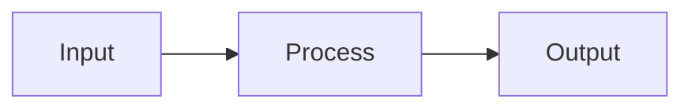

Dalam konteks Linux input/output adalah :
* Keyboard (input)
* Layar (output)
* Files
* Struktur data kernel
* Peralatan I/O lainnya (misalnya Network)

## 2. FILE DESCRIPTOR

Linux berkomunikasi dengan file melalui file descriptor yang direpresentasikan melalui angka yang dimulai dari 0, 1, 2 dan seterusnya. Tiga buah file descriptor standar yang lalu diciptakan oleh proses adalah :
* 0 = keyboard (standar input)
* 1 = layar (standar output)
* 2 = layar (standar error)

Linux tidak membedakan antara peralatan hardware dan file. Linux memanipulasi peralatan hardware dengan memperlakukannya sama dengan ketika memperlakukan sebuah file.

## 3.PEMBELOKAN (REDIRECTION)

Pembelokan dilakukan untuk standard input, output dan error, yaitu untuk mengalihkan file descriptor dari 0, 1 dan 2. Simbol untuk pembelokan adalah :
```mermaid
flowchart LR
    A(Standart Input) -->|Keyboard| B{Process}
    B -->|Monitor| C[Standart Output]
    B -->|Monitor| D[Standart Error]
 ```

## 4. PIPA (PIPELINE)
Mekanisme pipa digunakan sebagai alat komunikasi antar proses.

```mermaid
graph LR
  A(Input) --> B(Proses-1) --> C(Output) --> D(Input) --> E(Proses-2) --> F(Output)
```
Proses-1 menghasilkan output yang selanjutnya digunakan sebagai input oleh Proses-2. Hubungan output input ini dinamakan ``pipa ataiupipelining``, yang menghubungkan Proses-1 dengan Proses-2 dan dinyatakan dengan symbol “|”.
```
    Proses1 | Proses
```

## 5. FILTER
Filter adalah utilitas Linux yang dapat memproses standard input (dari keyboard) dan menampilkan hasilnya pada standard output (layar). Contoh filter adalah cat, sort, grep, pr, head, tail, paste dan lainnya.
Pada sebuah rangkaian pipa : 

        P<sub>1</sub> | P<sub>2</sub> | P<sub>3</sub> ... | P<sub>n-1</sub> | P<sub>n</sub>

Maka P2 sampai dengan P<sub>n-1</sub> berfungsi sebagai filter. P1 (awal) dan Pn (terakhir) boleh tidak filter. Utilitas yang bukan filter misalnya who, ls, ps, lp, lpr, mail dan lainnya.
Beberapa perintah Linux yang digunakan untuk proses penyaringan antara lain :
* Perintah ``grep``
  Digunakan untuk menyaring masukannya dan menampilkan baris-baris yang hanya mengandung pola yang ditentukan. Pola ini disebut regular expression.
* Perintah ``wc``
  Digunakan untuk menghitung jumlah baris, kata dan karakter dari baris-baris masukan yang diberikan kepadanya. Untuk mengetahui berapa baris gunakan option –l, untuk mengetahui berapa kata, gunakan option –w dan untuk mengetahui berapa karakter, gunakan option –c. 
  Jika salah satu option tidak digunakan, maka tampilannya adalah jumlah baris, jumlah kata dan jumlah karakter.
* Perintah ``sort``
  Digunakan untuk mengurutkan masukannya berdasarkan urutan nomor ASCII dari karakter.
* Perintah ``cut``
  Digunakan untuk mengambil kolom tertentu dari baris-baris masukannya, yang ditentukan pada option –c.
* Perintah ``uniq``
  Digunakan untuk menghilangkan baris-baris berurutan yang mengalami duplikasi, biasanya digabungkan dalam pipeline dengan ``sort``.

## TUGAS PENDAHULUAN:

## Jawablah pertanyaan-pertanyaan di bawah ini :

1. Apa yang dimaksud redirection?
   - Pembelokan yang dilakukan untuk standar input, output, dan error dan untuk mengalihkan file descriptor dari 0, 1, dan 2.
2. Apa yang dimaksud pipeline?
   - Suatu mekanisme pipa yang digunakan sebagai alat komunikasi antar proses.
3. Apa yang dimaksud perintah di bawah ini :
    echo, cat, more, sort, grep, wc, cut, uniq
    - ``echo`` : digunakan untuk menampilkan text.
    - ``cat`` : perintah untuk melihat isi file.
    - ``more`` : digunakan untuk membuka file satu per satu.
    - ``sort`` : digunakan untuk mengurutkan .masukannya berdasarkan urutan nomor ASCII dari karakter.
    - ``grep`` : digunakan untuk menyaring masukannya dan menampilkan baris-baris yang hanya mengandung pola yang ditentukan.
    - ``wc`` : digunakan untuk menghitung jumlah baris, kata dan karakter dari baris-baris masukan yang diberikan kepadanya.
    - ``cut`` : digunakan untuk mengambil kolom tertentu dari baris-baris masukannya,
    - ``uniq`` : digunakan untuk menghilangkan baris-baris berurutan yang mengalami duplikasi, biasanya digabungkan dalam pipeline dengan sort.

## PERCOBAAN:

1. Login sebagai user.
2. Bukalah Console Terminal dan lakukan percobaan-percobaan di bawah ini. Perhatikan hasil setiap percobaan.
3. Selesaikan soal-soal latihan.


## Percobaan 1 : File descriptor

1. Output ke layar (standar output), input dari system (kernel)
    ```
    $ ps
    ```
    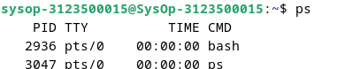
2. Output ke layar (standar output), input dari keyboard (standard input)
   ```
    $ cat
    hallo, apa khabar
    hallo, apa khabar
    exit dengan ^d
    exit dengan ^d
    [Ctrl-d]
   ```
   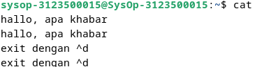

3. Input nama direktori, output tidak ada (membuat direktori baru), bila terjadi error maka tampilan error pada layar (standard error)
   ```
   $ mkdir mydir
   $ mkdir mydir **(Terdapat pesan error)**
   ```
    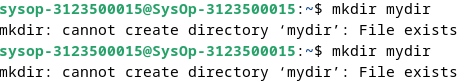

## Percobaan 2 : Pembelokan (redirection)
1. Pembelokan standar output
   ```
    $ cat 1> myfile.txt
    Ini adalah teks yang saya simpan ke file myfile.txt
   ```
   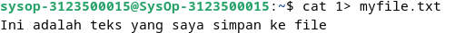
2. Pembelokan standar input, yaitu input dibelokkan dari keyboard menjadi dari file
   ```
    $ cat 0< myfile.txt
    $ cat myfile.txt
   ```
   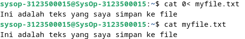
3. Pembelokan standar error untuk disimpan di file
   ```
    $ mkdir mydir (Terdapat pesan error)
    $ mkdir mydir 2> myerror.txt
    $ cat myerror.txt
   ```
   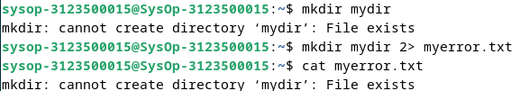
4. Notasi 2>&1 : pembelokan standar error (2>) adalah identik dengan file descriptor 1.
   ```
    $ ls filebaru (Terdapat pesan error)
    $ ls filebaru 2> out.txt
    $ cat out.txt
    $ ls filebaru 2> out.txt 2>&
    $ cat out.txt
   ```
   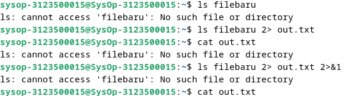
5. Notasi 1>&2 (atau >&2) : pembelokan standar output adalah sama dengan file descriptor 2 yaitu standar error
   ```
   $ echo “mencoba menulis file” 1> baru
   $ cat filebaru 2> baru 1>&
    $ ls filebaru 2> out.tx7
   $ cat baru
   ```
   
6. Notasi >> (append)
   ```****
   $ echo “kata pertama” > surat
   $ echo “kata kedua” >> surat
   $ echo “kata ketiga” >> surat
    $ ls filebaru 2> out.tx8
   $ cat surat
   $ echo “kata keempat” > surat
   $ cat surat
   ```
   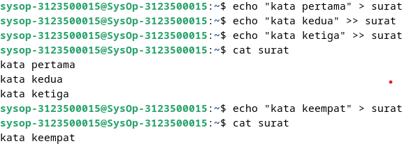
7. Notasi here document (<<++ .... ++) digunakan sebagai pembatas input dari keyboard. Perhatikan bahwa tanda pembatas dapat digantikan dengan tanda apa saja, namun harus sama dan tanda penutup harus diberikan pada awal baris
   ```
   $ cat <<++
   Hallo, apa kabar?
   Baik-baik saja?
   Ok!
   ++
   $ cat <<%%%
   Hallo, apa kabar?
   Baik-baik saja?
   Ok!
   %%%
   ```
   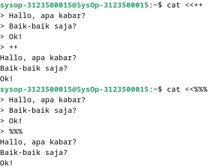
8. Notasi – (input keyboard) adalah representan input dari keyboard. Artinya menampilkan file 1, kemudian menampilkan input dari keyboard dan menampilkan file 2. Perhatikan bahwa notasi “-“ berarti menyelipkan input dari keyboard
  ```
  $ cat myfile.txt – surat
  ```
   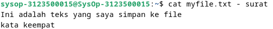

## Percobaan 3 : Pipa (pipeline)

1. Operator pipa (|) digunakan untuk membuat eksekusi proses dengan melewati data langsung ke data lainnya.
   ```
   $ who
   $ who | sort
   $ who | sort –r
   $ who > tmp
   $ sort tmp
   $ rm tmp
   $ ls –l /etc | more
   $ ls –l /etc | sort | more
   ```
   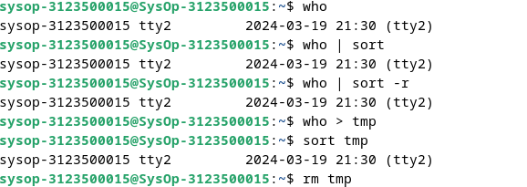
   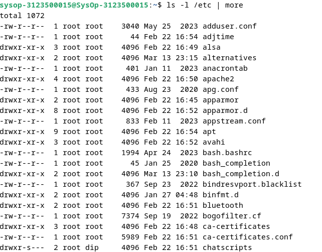
   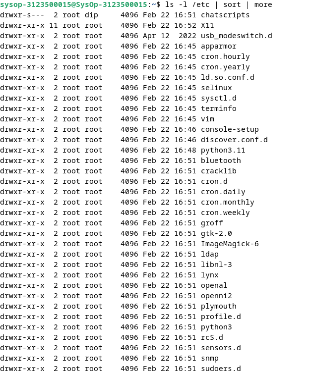
2. Untuk membelokkan standart output ke file, digunakan operator ">"
   ```
   $ echo hello
   $ echo hello > output
   $ cat output
   ```
   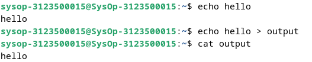
3. Untuk menambahkan output ke file digunakan operator ">>"
   ```
   $ echo bye >> output
   $ cat output
   ```
   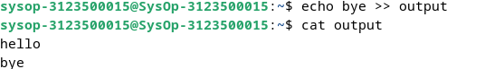
4. Untuk membelokkan standart input digunakan operator "<"
   ```
   $ cat < output
   ```
   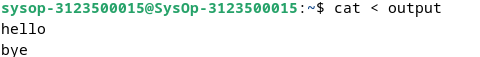
5. Pembelokan standart input dan standart output dapat dikombinasikan tetapi tidak boleh menggunakan nama file yang sama sebagai standart input dan output.
   ```
   $ cat < output > out
   $ cat out
   $ cat < output >> out
   $ cat out
   $ cat < output > output
   $ cat output
   $ cat < out >> out (Proses tidak berhenti)
   [Ctrl-c]
   $ cat out
   ```
   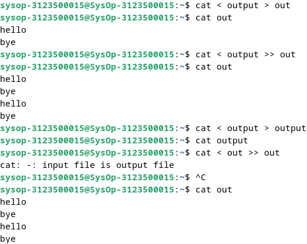

## Percobaan 4 : Filter
1. Pipa juga digunakan untuk mengkombinasikan utilitas sistem untuk membentuk fungsi yang lebih kompleks
   ```
    $ w –h | grep <user>
    $ grep <user> /etc/passwd
    $ ls /etc | wc
    $ ls /etc | wc –l
    $ cat > kelas1.txt
    Badu
    Zulkifli
    Yulizir
    Yudi
    Ade
    [Ctrl-d]
    $ cat > kelas2.txt
    Budi
    Gama
    Asep
    Muchlis
    [Ctrl-d]
    $ cat kelas1.txt kelas2.txt | sort
    $ cat kelas1.txt kelas2.txt > kelas.txt
    $ cat kelas.txt | sort | uniq
   ```
   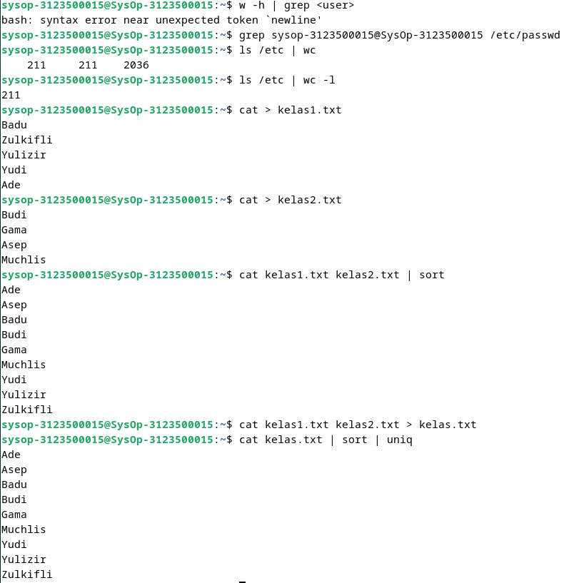

## LATIHAN:

1. Lihat daftar secara lengkap pada direktori aktif, belokkan tampilan standard output   ke file baru.
   
2. Lihat daftar secara lengkap pada direktori /etc/passwd, belokkan tampilan standard output ke file baru tanpa menghapus file baru sebelumnya.
   
   
3. Urutkan file baru dengan cara membelokkan standard input.
   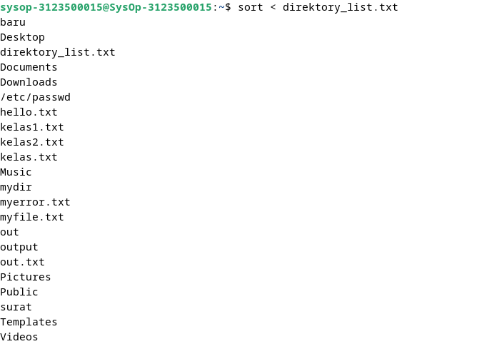
4. Urutkan file baru dengan cara membelokkan standard input dan standard output ke file baru.urut.
   
5. Buatlah direktori latihan 2 sebanyak 2 kali dan belokkan standard error ke file rmdirerror.txt.
   
6. Urutkan kalimat berikut :
   ```
   Jakarta
   Bandung
   Surabaya
   Padang
   Palembang
   Lampung
   ```
   Dengan menggunakan notasi **here document (<@@@ ...@@@)** . [HINT](https://www.geeksforgeeks.org/how-to-use-here-document-in-bash-programming/)
   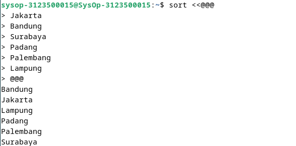

1. Hitung jumlah baris, kata dan karakter dari file baru.urut dengan menggunakan filter dan tambahkan data tersebut ke file baru.
   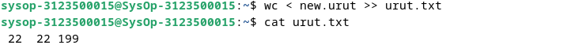
2. Gunakan perintah di bawah ini dan perhatikan hasilnya.
   ```
    $ cat > hello.txt
    dog cat
    cat duck
    dog chicken
    chicken duck
    chicken cat
    dog duck
    [Ctrl-d]
    $ cat hello.txt | sort | uniq
    $ cat hello.txt | grep “dog” | grep –v “cat”
   ```
   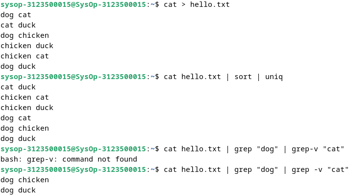

## Kesimpulan
Redirection, Pipeline, dan Perintah-perintah yang disebutkan adalah bagian integral dari sistem operasi UNIX/Linux dan digunakan untuk mengelola aliran data, mengelola file, dan melakukan operasi pada teks.

   - Redirection: Redirection adalah proses mengalihkan aliran data standar masukan (stdin), standar keluaran (stdout), dan standar error (stderr) dalam UNIX/Linux. Ini memungkinkan pengguna untuk mengarahkan output dari suatu perintah ke file atau perintah lain, atau mengambil input dari file atau perintah lain. Contoh penggunaan redirection adalah >, <, >>, dan 2>.
   - Pipeline adalah mekanisme yang memungkinkan pengguna untuk mengalirkan keluaran dari satu perintah ke masukan perintah lain secara langsung, tanpa menyimpannya ke dalam file sementara. Ini memungkinkan pengguna untuk menggabungkan beberapa perintah bersama-sama untuk melakukan tugas yang kompleks. Pipeline ditandai dengan simbol |. Misalnya, command1 | command2 akan mengalirkan keluaran dari command1 ke masukan command2.
   - Perintah-perintah:
     - `echo` Menampilkan teks atau variabel ke output standar.
      - `cat` Membaca isi file dan menampilkannya di output standar.
     - `more` Menampilkan isi file satu layar pada satu waktu.
     - `sort` Mengurutkan baris-baris inputnya berdasarkan urutan ASCII.
     - `grep` Mengambil inputnya dan mencari pola yang cocok, lalu menampilkan baris yang sesuai.
     - `wc` Menghitung jumlah baris, kata, dan karakter dari inputnya.
     - `cut` Memotong kolom-kolom tertentu dari inputnya.
     - `uniq` Menghilangkan baris duplikat berturut-turut dari inputnya.


## LAPORAN RESMI:

1. Analisa hasil percobaan 1 sampai dengan 4, untuk setiap perintah jelaskan    tampilannya.
2. Kerjakan latihan diatas dan analisa hasilnya
3. Berikan kesimpulan dari praktikum ini.