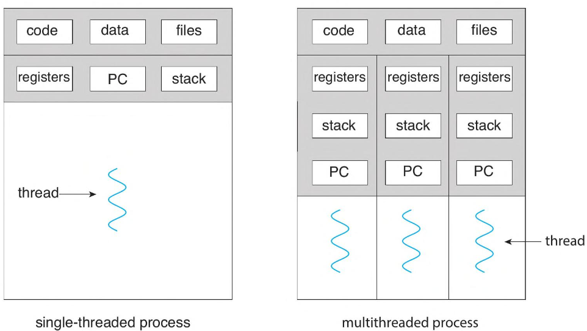
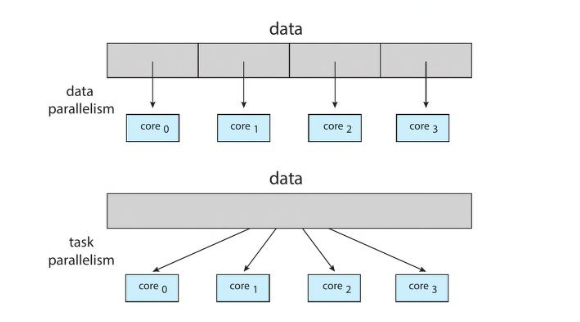
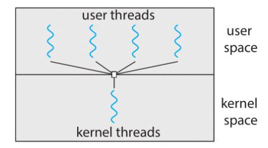
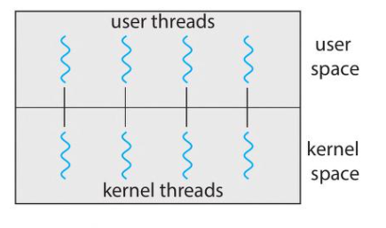
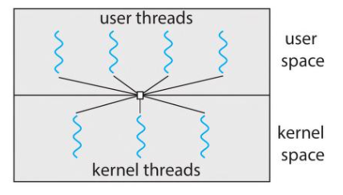

  <h1 style="text-align: center;font-weight: bold">Praktikum 10 Praktek Sistem Operasi</h1>
  <h4 style="text-align: center;">Dosen Pengampu : Dr. Ferry Astika Saputra, S.T., M.Sc.</h4>

 

  
  <h3 style="text-align: center;">Disusun Oleh :</h3>
  

    <strong>Calvin Raditya Sandy Winarto (3123500009)</strong> 
    <strong>Zada Devi Mariama (3123500015)</strong>

<h3 style="text-align: center;line-height: 1.5">Politeknik Elektronika Negeri Surabaya Departemen Teknik Informatika Dan Komputer Program Studi Teknik Informatika 2024/2025</h3>
  

# Thread

Thread adalah unit dasar dari pemanfaatan CPU. Setiap proses hanya memiliki satu thread, karenanya program hanya dapat menjalankan satu tugas dalam satu waktu. Terdapat juga istilah multithreading, yaitu ketika proses memiliki beberapa thread dan prosesnya dapat menjalankan beberapa tugas pada satu waktu.

Sebagian besar aplikasi software yang berjalan di komputer modern dan perangkat mobile bersifat multithread. Berikut merupakan contoh aplikasi multithread :

a.	Aplikasi pembuat tumbnail foto dari koleksi gambar yang menggunakan thread terpisah untuk menghasilkan thumbnail dari setiap gambar yang terpisah.

b.	Web browser memiliki satu thread untuk menampilkan gambar atau teks, sementara thread lain  mengambil data dari jaringan.

c.	Word processor (pengolah kata) memmiliki thread untuk menampilkan grafik. Sedangkan thread lain merespons penekanan tombol dari pengguna dan thread ketiga melakukan pengecekan ejaan dan tata bahasa di background. 

## Benefits

Manfaat pemrograman multithreading dapat dibagi ke dalam empat kategori :

a.	Responsives  

Program dengan kemampuan untuk multithread dapat memperbolehkan program untuk melakukan beberapa tugas secara bersamaan atau disebut multitasking. Hal ini sangat memperbolehkan pengguna dapat menggunakan fungsi utama program dan secara bersamaan program dapat memberikan fitur tambahan yang membantu pengguna dalam melesaikan tugasnya tanpa menunggu pengguna berhenti menggunakn program. Hal ini yang disebut responsive yang dimana penggua dapat menerima informasi secara instan dari hasil inputnya. 

b.	Resource sharing 

Sebuah proses yang terdiri dari banyak thread akan memilki resource yang sama. Resource ini adalah termasuk data di storage, ruang memory dan proses heap dan stack. Dengan ini setiap tugas yang dijalankan oleh thread tidak perlu memesan resources tambahan dari sistem memory namun mengunakan resource yang telah berada dalam memory yang telah diambil oleh thread yang lain. Saling membagi resource ini juga memungkinkan untuk efesiensi dalam dalam komputasi data yang sama.

c.	Economy

Mengalokasikan memory dan resource lainnya untuk membuat proses sangatlah mahal. Dengan itu, membuat proses baru sangat tidak efisien. Sebaliknya, membuat thread lebih murah dan lebih cepat. Sebuah thread juga lebih mudah untuk berpindah antara proses, dengan itu lebih efisien untuk saling beralih thread antara tugas dibandingkan untuk membuat proses baru untuk membuat tugas.

d.	Scalability

Ketika jumlah beban dalam komputasi proses meningkat dalam sistem, maka diperlukan tenaga komputasi yang lebih dalam sistem. Bila sistem dan program mendukung multithreading, maka kita dapat menambahkan jumlah core dalam processor kita  atau jumlah processor dalam sistem. Hal ini memperbolehkan untuk membagi thread-thread proses kepada setiap core secara paralel. Namun jika sistem hanya memliki satu thread proses, maka proses tersebut hanya akan dapat di eksekusi oleh satu core, tidak peduli jumlah core yang tersedia dalam sistem atau processor sistem memerlukan menambahkan frekuensi core yang dimana lebih sulit di buat dan lebih banyak menggunakan tenaga listrik.

## Types of Parallelism

Secara umum, ada dua jenis paralelisme: 

1. Parallel Data

    Paralelisme data berfokus pada pendistribusian subset dari data yang sama di beberapa inti komputasi dan melakukan operasi yang sama pada setiap inti. 
2. Parallel Task 

    Paralelisme tugas melibatkan pendistribusian bukan data, melainkan tugas (thread) di beberapa inti komputasi.

## Multithreading models 

1.	Many-to-One Model

Model many-to-one memetakan banyak thread tingkat pengguna ke satu thread kernel. Manajemen thread dilakukan oleh thread library di ruang pengguna, sehingga efisien. Namun, seluruh proses akan diblokir jika thread membuat panggilan sistem pemblokiran. Juga, karena hanya satu thread dapat mengakses kernel pada satu waktu, beberapa thread tidak dapat berjalan secara paralel pada sistem multicore. Namun, sangat sedikit sistem yang terus menggunakan model ini karena ketidakmampuannya untuk memanfaatkan beberapa inti pemrosesan, yang kini telah menjadi standar pada sebagian besar sistem komputer.

2.	One-to-One Model

Model One-to-One memetakan setiap thread pengguna ke thread kernel. Ini memberikan lebih banyak konkurensi daripada model many-to-one dengan memungkinkan thread lain berjalan ketika thread membuat panggilan sistem pemblokiran. Hal ini juga memungkinkan beberapa thread untuk berjalan secara paralel pada multiprosesor. Satu-satunya kelemahan untuk model ini adalah bahwa membuat thread pengguna memerlukan pembuatan thread kernel yang sesuai, dan sejumlah besar thread kernel dapat membebani kinerja sistem. Linux, bersama dengan keluarga sistem operasi Windows, menyiratkan model satu-ke-satu.

3.	Many-to-Many Model

Model Many-to-Many memultiplekskan banyak thread tingkat pengguna ke jumlah thread kernel yang lebih kecil atau sama. Jumlah thread kernel mungkin spesifik untuk aplikasi tertentu atau mesin tertentu (aplikasi dapat dialokasikan lebih banyak thread kernel pada sistem dengan delapan core pemrosesan daripada sistem dengan empat core).

note : Memultiplekskan adalah tindakan menggabungkan beberapa sinyal atau data ke dalam satu saluran atau jalur komunikasi. Dalam konteks komputer atau jaringan, multiplexing sering digunakan untuk mengirimkan data secara efisien melalui kabel atau media transmisi. 

## Thread Libraries 

Sebuah thread library menyediakan API bagi programmer untuk membuat dan mengelola thread. Ada dua cara utama untuk mengimplementasikan thread library. Pendekatan pertama adalah menyediakan library sepenuhnya di ruang pengguna tanpa dukungan kernel. Semua kode dan struktur data untuk library ada di ruang pengguna. Ini berarti bahwa memanggil fungsi di pustaka menghasilkan panggilan fungsi lokal di ruang pengguna dan bukan panggilan sistem.  

Pendekatan kedua adalah mengimplementasikan library tingkat kernel yang didukung langsung oleh sistem operasi. Dalam hal ini, kode dan struktur data untuk library ada di ruang kernel. Memanggil fungsi dalam API untuk library biasanya menghasilkan panggilan sistem ke kernel.

Tiga thread library utama digunakan saat ini: POSIX Pthreads, Windows, dan Java. 
 1. Pthreads, ekstensi threads dari standar POSIX, dapat disediakan sebagai library tingkat pengguna atau tingkat kernel.Pthreads mengacu pada standar POSIX (IEEE 1003.1c) yang mendefinisikan API untuk pembuatan dan sinkronisasi thread. Ini adalah spesifikasi untuk perilaku thread, bukan implementasi. Perancang sistem operasi dapat menerapkan spesifikasi dengan cara apa pun yang mereka inginkan. Banyak sistem mengimplementasikan spesifikasi Pthreads; sebagian besar adalah sistem tipe UNIX, termasuk Linux dan macOS. 
    
 2.  Windows Thread adalah library tingkat kernel yang tersedia di sistem Windows. Teknik untuk membuat thread menggunakan thread library Windows mirip dengan teknik Pthreads dalam beberapa cara. Perhatikan bahwa jendela harus disertakan. h header saat menggunakan Windows API.

 3. Java thread API memungkinkan thread dibuat dan dikelola langsung dalam program Java. Namun, karena dalam kebanyakan kasus JVM berjalan di atas sistem operasi host, Java thread API umumnya diimplementasikan menggunakan thread library yang tersedia di sistem host. Ini berarti bahwa pada sistem Windows, thread di Java biasanya diimplementasikan menggunakan Windows API; Sistem UNIX, Linux, dan macOS biasanya menggunakan Pthreads.

## Implicit Threading

1.	Thread Pools
    
    Thread yang tidak terbatas dapat menghabiskan sumber daya sistem, seperti waktu CPU atau memori. Salah satu solusi untuk masalah ini adalah dengan menggunakan thread pool.

2.	Fork Join
    
    Metode ini, thread induk utama membuat (fork) satu atau lebih thread anak dan kemudian menunggu anak-anak untuk mengakhiri dan bergabung dengannya, pada titik mana ia dapat mengambil dan menggabungkan hasilnya. 

3.	OpenMp
    
    OpenMP adalah seperangkat arahan kompiler serta API untuk program yang ditulis dalam C, C ++, atau FORTRAN yang menyediakan dukungan untuk pemrograman paralel di lingkungan memori bersama. OpenMP mengidentifikasi wilayah paralel sebagai blok kode yang dapat berjalan secara paralel. 

4.	Grand Central Dispatch
    
    Grand Central Dispatch (GCD) adalah teknologi yang dikembangkan oleh Apple untuk sistem operasi macOS dan iOS-nya. Ini adalah kombinasi dari pustaka run-time, API, dan ekstensi bahasa yang memungkinkan pengembang mengidentifikasi bagian kode {tugas) untuk dijalankan secara paralel. Seperti OpenMP, GCD mengelola sebagian besar detail threading.

5.	Intel Thread Building Blocks 
    
    Intel threading building block (TBB) adalah pustaka templat yang mendukung desain¬ing aplikasi paralel di C++. Karena ini adalah library, tidak memerlukan kompiler khusus atau dukungan bahasa. Pengembang menentukan tugas yang dapat berjalan secara paralel, dan penjadwal tugas TBB memetakan tugas ini ke thread yang mendasarinya. 

# Q & A 

1. Apa yang dimaksud dengan Thread Priority?
    
    Setiap thread memiliki prioritas. Namun, prioritas yang lebih tinggi juga diutamakan dalam eksekusi. Namun, itu juga tergantung pada implementasi Thread Scheduler yang bergantung pada OS. Dimungkinkan untuk mengubah prioritas utas, tetapi tidak memberikan jaminan bahwa utas prioritas yang lebih tinggi akan dieksekusi terlebih dahulu

2. Bagaimana beberapa thread dapat dikontrol secara bersamaan?
   
   Beberapa thread dapat dikontrol secara bersamaan jika dibuat dalam objek ThreadGroup.

3. Apa perbedaan antara thread tingkat pengguna dan thread tingkat kernel?
    
    User-level threads (ULTs) dan kernel-level threads (KLTs) berbeda dalam manajemen dan alokasi sumber daya. ULT dikelola oleh program ruang pengguna, bukan OS, membuatnya lebih cepat untuk dibuat dan dikelola karena pengalihan konteks yang lebih sedikit. Namun, jika satu blok ULT, semua utas dalam blok proses, karena OS hanya melihat prosesnya.
    Di sisi lain, KLT dikelola langsung oleh OS, memungkinkan multitasking yang lebih baik karena utas yang diblokir tidak memengaruhi orang lain dalam proses yang sama. Namun, mereka membutuhkan lebih banyak overhead karena peningkatan pengalihan konteks dan keterlibatan OS langsung.

4. Apa peran semaphore dalam multithreading?
    
    Semaphore dalam multithreading adalah alat sinkronisasi yang digunakan untuk mengontrol akses ke sumber daya bersama. Ini pada dasarnya adalah variabel yang mempertahankan jumlah sumber daya yang tersedia, atau slot. Ketika thread ingin menggunakan sumber daya, ia memeriksa semaphore. Jika hitungan lebih besar dari nol, thread mengurangi hitungan dan melanjutkan. Jika hitungannya nol, utas harus menunggu hingga slot tersedia. Mekanisme ini mencegah kondisi balapan dengan memastikan bahwa hanya satu utas yang dapat memodifikasi sumber daya bersama pada waktu tertentu. Semaphore juga membantu mengelola kebuntuan, di mana dua utas saling menunggu untuk melepaskan sumber daya.
5. Bagaimana Anda bisa memastikan bahwa thread dijalankan dalam urutan tertentu?
   
    Urutan eksekusi thread dapat dikontrol menggunakan teknik sinkronisasi. Salah satu metode umum adalah menggunakan join(), yang membuat thread menunggu sampai selesainya yang lain. Misalnya, jika kita ingin Thread B dieksekusi setelah Thread A, kita memanggil B.join() dalam metode run A.
    Pendekatan lain melibatkan semaphore. Semaphore mempertahankan seperangkat izin; Sebuah thread dapat memperoleh izin (jika tersedia) atau melepaskannya kembali ke semaphore. Jika izin tidak tersedia, utas akan diblokir sampai izin. Dengan mengontrol jumlah izin awal dan distribusinya di antara utas, kita dapat menentukan perintah eksekusi.
    Terakhir, kita bisa menggunakan kunci. Kunci hanya mengizinkan satu utas pada satu waktu untuk mengakses sumber daya bersama. Dengan menempatkan kunci secara strategis, kita dapat memastikan bahwa bagian kode tertentu dijalankan oleh utas tertentu dalam urutan tertentu.

# Referensi
Operating System Concept 10th Edition by A. Silberschatz, P. Bear Galvin, G. Gage (ch. 3 and 4)