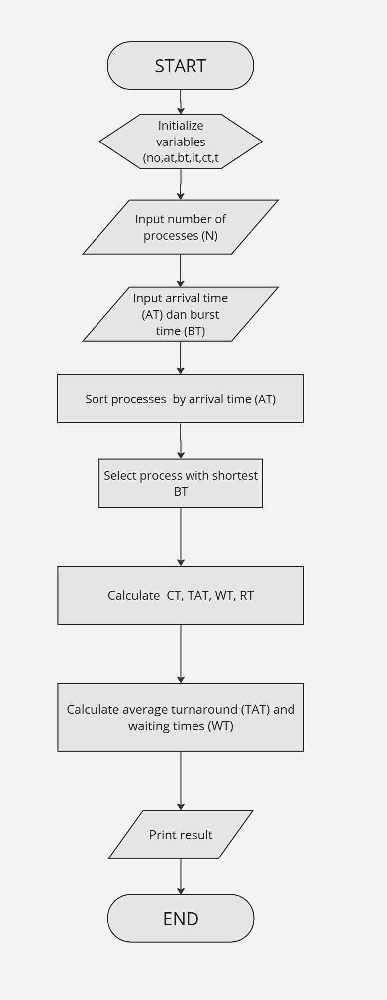

  <h1 style="text-align: center;font-weight: bold">Praktikum 11 Praktek Sistem Operasi</h1>
  <h4 style="text-align: center;">Dosen Pengampu : Dr. Ferry Astika Saputra, S.T., M.Sc.</h4>

 

  
  <h3 style="text-align: center;">Disusun Oleh :</h3>
  

    <strong>Calvin Raditya Sandy Winarto (3123500009)</strong> 
    <strong>Zada Devi Mariama (3123500015)</strong>

<h3 style="text-align: center;line-height: 1.5">Politeknik Elektronika Negeri Surabaya Departemen Teknik Informatika Dan Komputer Program Studi Teknik Informatika 2024/2025</h3>
  

#Scheduling Algorithms

1. First Come First Served Scheduling

Analisis: Algoritma diatas merupakan algoritma penjadwalan FCFS yang bersifat non-preemptive, dimana proses yang tiba lebih dulu dieksekusi terlebih dahulu. Program dimulai dengan melakukan inisialisasi variabel dan memasukkan jumlah proses. Selanjutnya, memasukkan waktu kedatangan(AT) dan waktu eksekusi (BT).  Proses ditempatkan dalam antrian siap berdasarkan waktu kedatangan(AT). Program menghitung waktu selesai (CT), waktu putaran (TAT), dan waktu tunggu (WT) untuk setiap proses. Setelah itu, program akan menghitung rata rata waktu putaran (TAT) dan rata-rata waktu tunggu (WT). 

2. Shortest Job First Scheduling

Analisis: Program di atas mengimplementasikan algoritma penjadwalan SJF (Shortest Job First) yang bersifat non-preemptive. Algoritma ini mengurutkan proses berdasarkan waktu burst time terpendek. Program diawali dengan melakukan inisialisasi variabel dan memasukkan jumlah proses yang ingin dieksekusi. Selanjutnya, memasukkan waktu kedatangan(AT) dan waktu eksekusi (BT).  Program mengurutkan proses berdasarkan waktu kedatangan. Kemudian, memilih proses pertama yang memiliki burst time terkecil di antara proses yang datang pada waktu yang sama. Setelah memilih proses pertama, program menghitung waktu selesai (Completion Time, CT), waktu putaran (Turnaround Time, TAT), dan waktu tunggu (Waiting Time, WT) untuk setiap proses. CT dihitung sebagai AT + BT untuk proses pertama, dan untuk proses-proses berikutnya, CT dihitung berdasarkan waktu selesai proses sebelumnya.  Setelah itu, program akan menghitung rata-rata waktu putaran (TAT) dan rata-rata waktu tunggu (WT). 

3. Round Robin Scheduling

Analisis: Program di atas mengimplementasikan algoritma penjadwalan Round Robin menggunakan struktur data queue untuk mengelola urutan proses. Program diawali dengan melakukan inisialisasi variabel dan memasukkan jumlah proses yang ingin dieksekusi dan Time Quantum. . Selanjutnya, memasukkan waktu kedatangan(AT) dan waktu eksekusi (BT). Mengurutkan proses berdasarkan arrival time. Program menghitung waktu selesai (CT), waktu putaran (TAT), dan waktu tunggu (WT) untuk setiap proses. Setelah itu, program akan menghitung rata rata waktu putaran (TAT) dan rata-rata waktu tunggu (WT). Jika sebuah proses tidak selesai dalam time quantum tersebut, proses tersebut ditunda dan dimasukkan kembali ke antrian untuk dieksekusi kembali setelah proses-proses lainnya mendapat giliran.