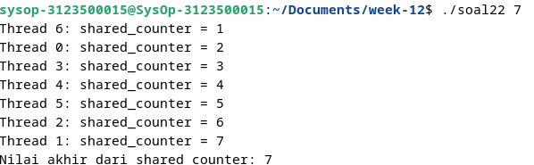

  <h1 style="text-align: center;font-weight: bold">Praktikum 12 Praktek Sistem Operasi</h1>
  <h4 style="text-align: center;">Dosen Pengampu : Dr. Ferry Astika Saputra, S.T., M.Sc.</h4>

 

  
  <h3 style="text-align: center;">Disusun Oleh :</h3>
  

    <strong>Calvin Raditya Sandy Winarto (3123500009)</strong> 
    <strong>Zada Devi Mariama (3123500015)</strong>

<h3 style="text-align: center;line-height: 1.5">Politeknik Elektronika Negeri Surabaya Departemen Teknik Informatika Dan Komputer Program Studi Teknik Informatika 2024/2025</h3>
  

1. 

Output :

Analisis : 

Kode program di atas adalah contoh multithreading sederhana menggunakan POSIX threads (pthreads) dalam bahasa C. Program memiliki variabel global shared_counter yang diakses dan dimodifikasi oleh beberapa thread. Fungsi thread_function menambahkan nilai shared_counter dan mencetak nilainya beserta ID thread. Program memeriksa jumlah argumen (jumlah thread) dan mencetak pesan kesalahan jika tidak sesuai. Program mengalokasikan memori untuk array ID thread (pthread_t) dan membuat thread sebanyak jumlah yang ditentukan. Setelah semua thread selesai, program menunggu mereka selesai, membebaskan memori, dan mencetak nilai akhir shared_counter, yang mencerminkan hasil penambahan dari semua thread. Kode ini menunjukkan cara membuat thread, melakukan sinkronisasi, dan mengakses sumber daya bersama.

2.

Output :

Analisis :

Kode program diatas menunjukkan contoh penggunaan mutex untuk mengamankan akses ke variabel bersama (shared_counter) dalam lingkungan multithreading. Dengan menggunakan mutex, dipastikan bahwa hanya satu thread yang dapat mengubah nilai shared_counter pada satu waktu. Variabel pthread_mutex_t shared_counter_mutex adalah mutex (pengunci) yang digunakan untuk mengamankan akses ke shared_counter. Setiap thread melakukan operasi peningkatan pada variabel bersama (shared_counter) dengan aman menggunakan mutex. Ini memastikan bahwa hanya satu thread yang dapat mengakses variabel tersebut pada satu waktu. 
