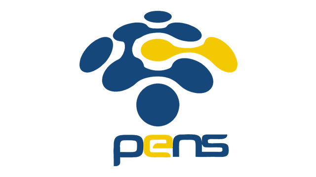

  <h1 style="text-align: center;font-weight: bold">Praktikum 2 Praktek Sistem Operasi</h1>
  <h4 style="text-align: center;">Dosen Pengampu : Dr. Ferry Astika Saputra, S.T., M.Sc.</h4>

 

  
  <h3 style="text-align: center;">Disusun Oleh :</h3>
  

    <strong>Calvin Raditya Sandy Winarto (3123500009)</strong> 
    <strong>Zada Devi Mariama (3123500015)</strong>
  

<h3 style="text-align: center;line-height: 1.5">Politeknik Elektronika Negeri Surabaya Departemen Teknik Informatika Dan Komputer Program Studi Teknik Informatika 2024/2025</h3>
  

 

# Daftar Isi

- [Daftar Isi](#daftar-isi)
- [Apa itu Motherboard?](#apa-itu-motherboard)
- [Komponen Motherboard](#komponen-motherboard)
- [Referensi](#referensi)

# Apa itu Motherboard?

  **Motherboard**
    adalah printed circuit board (PCB)  utama pada sebuah komputer untuk menghubungkan antar perangkat keras computer lainnya.
    Motherboard berfungsi untuk menampung semua komponen perangkat keras agar bisa saling terhubung dan berjalan dengan baik. Selain itu, motherboard juga berfungsi untuk mengatur kode BIOS pada ROM.

# Komponen Motherboard

    Motherboard sendiri terdiri dari beberapa komponen yang saling terintegrasi satu sama lain.

1) **Socket processor**
    - Socket  processor berfungsi sebagai tempat untuk meletakkan prosesor komputer. Terdapat 2 jenis socket processor, yaitu Socket LIF yang merupakan socket prosesor model lama, sedangkan ZIF adalah socket prosesor model baru.
    
2) **BIOS**
    - BIOS (Basic Input Output System) adalah salah satu chip yang sangat krusial dalam motherboard. Firmware yang digunakan untuk melakukan inisialisasi hardware selama booting dan menyediakan layanan runtime untuk sistem operasi dan program. BIOS memiliki fungsi melangsungkan POST (Power on Self Test) saat proses booting (menyalakan komputer).
    
3) **Battery CMOS**
    - Battery CMOS (Complimentary Metal Oxide Semicondutor), digunakan untuk memberi daya pada BIOS dan juga untuk menyimpan semua settingan yang ada pada BIOS.
    
4) **Chipset**
    - Chipset terdiri dari dua komponent
    
       1. Northbridge
           - Northbridge juga  dikenal sebagai host bridge atau Memory Controller Hub bertanggung jawab untuk tugas-tugas yang membutuhkan kinerja tertinggi.
       2. Southbridge
           - Southbridge mengatur komunikasi antara CPU dan komponen motherboard lainnya bersama northbridge. Kinerja lebih lambat.
5) **Slot Memory**
    - Slot memory berfungsi untuk memasang memori RAM (Random Access Memory). Posisinya bersebelahan dengan socket processor, pada umumnya ada lebih 1 slot memory agar bisa memasang beberapa RAM sekaligus.
    
6) **Slot IDE dan Slot SATA**
    - Slot IDE dan SATA berfungsi sebagai penghubung Hard Drive, dan CD-ROM. Slot IDE biasa digunakan pada motherboard dan hardisk jenis lama, sedangkan SATA lebih banyak digunakan pada motherboard dan jenis penyimpanan HardDisk atau SSD baru.
    
7)  **Slot PCI**
    - Slot PCI ini berfungsi untuk menambahkan perangkat Add-on Card seperti LAN card, VGA Card, Sound Card, USB Card, TV Tuner, dan perangkat tambahan lainnya.
    
8)  **Power Connector**
    - Power connector berfungsi untuk menyambungkan arus listrik power supply ke motherboard.
    
9)  **I/O Ports**
    - Fungsi I/O ports atau input output ports secara langsung berinteraksi dengan pengguna komputer. I/O ports menjadi sekumpulan ports sebagai tempat colokan untuk beragam perangkat input atau output, misalnya seperti port LAN, USB, PS/2 , VGA, dan sebagainya.
    
  

# Referensi

- [√ Apa itu Motherboard? Definisi, Fungsi, Bagian, & Jenisnya (thelastsurvivors.org)](https://www.thelastsurvivors.org/apa-itu-motherboard/)
- [Apa Itu Motherboard? Pengertian, Fungsi, dan Komponennya - GFN Blog (goldenfast.net)pengertian-sistem-operasi/>](https://www.goldenfast.net/blog/apa-itu-motherboard/)
- [<https://telkomuniversity.ac.id/pengertian-data-fungsi-jenis-jenis-manfaat-dan-contohnya/>](https://teknogram.id/kamus/motherboard/)
