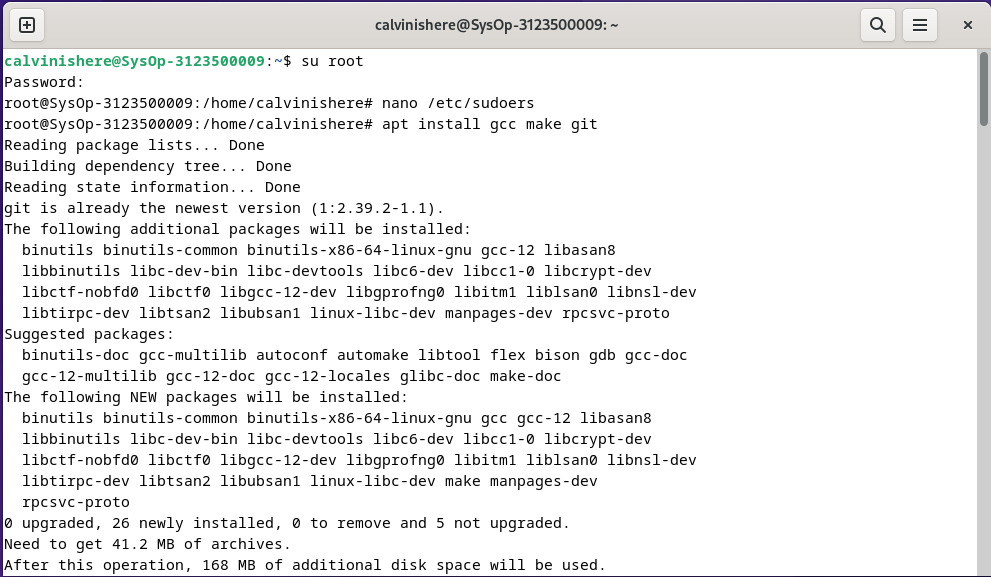
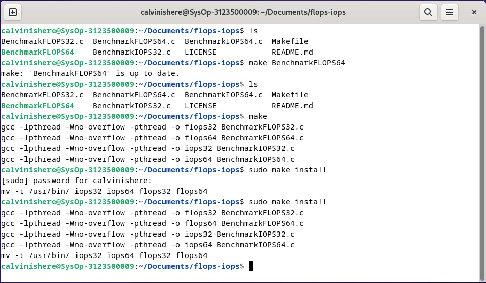
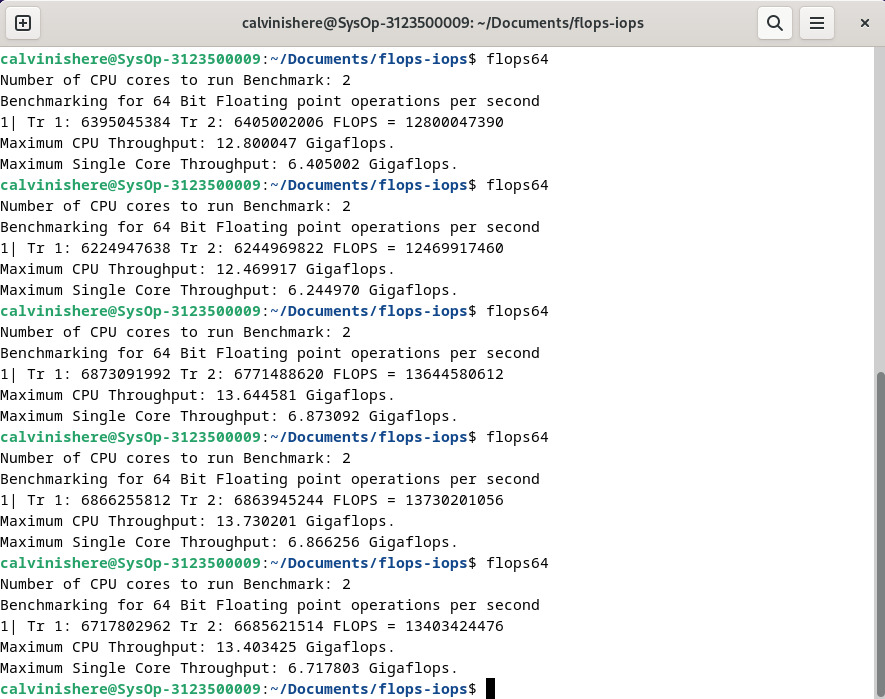
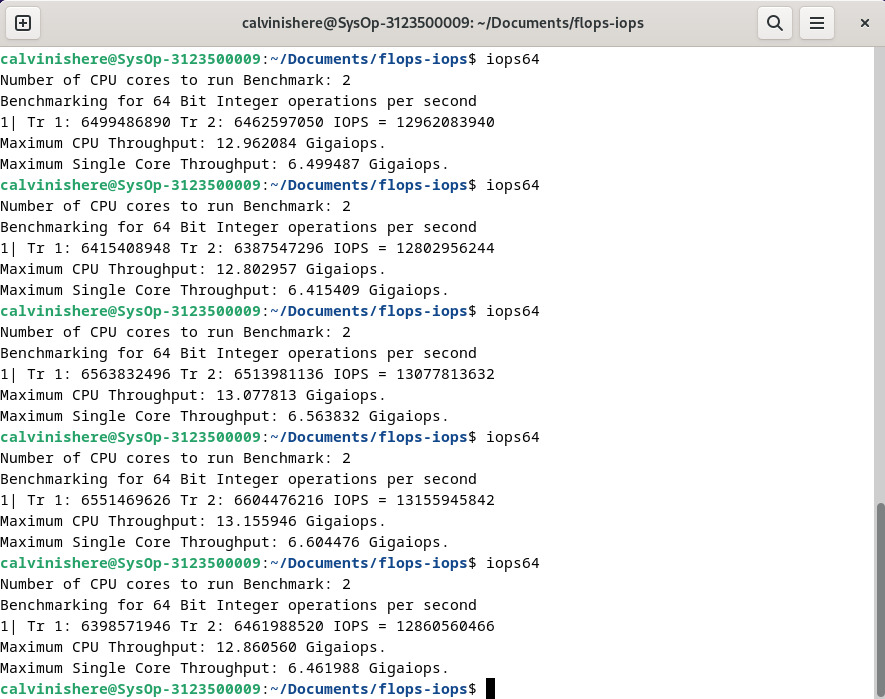
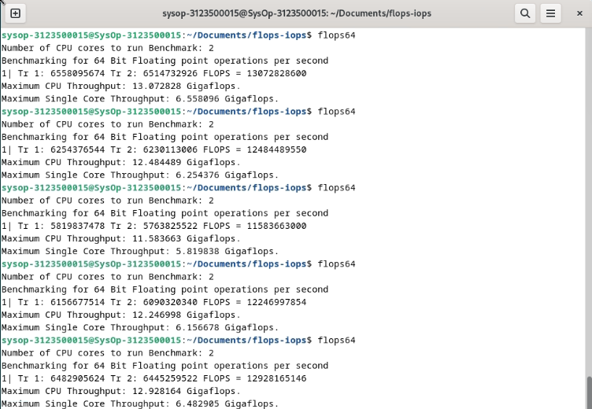
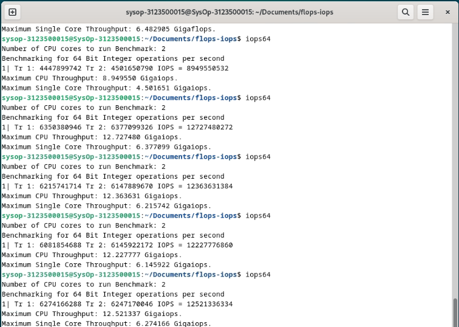

  <h1 style="text-align: center;font-weight: bold">Praktikum 3 Praktek Sistem Operasi</h1>
  <h4 style="text-align: center;">Dosen Pengampu : Dr. Ferry Astika Saputra, S.T., M.Sc.</h4>

 

  
  <h3 style="text-align: center;">Disusun Oleh :</h3>
  

    <strong>Calvin Raditya Sandy Winarto (3123500009)</strong> 
    <strong>Zada Devi Mariama (3123500015)</strong>
  

<h3 style="text-align: center;line-height: 1.5">Politeknik Elektronika Negeri Surabaya Departemen Teknik Informatika Dan Komputer Program Studi Teknik Informatika 2024/2025</h3>
  

 

## Daftar Isi

- [FlOPS dan IOPS](#flops-dan-iops)
    - [Install GCC, make dan GIT](#install-gcc-make-dan-git)
    - [Menjalankan FLOPS dan IOPS](#menjalankan-flops-dan-iops)
  - [Percobaan](#percobaan)
  - [Kesimpulan](#kesimpulan)
  - [Referensi](#referensi)

 

# FlOPS dan IOPS

### Install GCC, make dan GIT

### Menjalankan FLOPS dan IOPS

1. Calvin
   - Percobaan menjalankan FLOPS64 5 kali
   
   - Percobaan menjalankan IOPS64 5 kali
   
3. Devi
   - percobaan menjalankan FLOPS64 5 kali
   
   - Percobaan menjalankan IOPS64 5 kali
   

## Percobaan

| Nama | Processor | Max Single Core FLOPS | Max Single Core IOPS | Max CPU FLOPS | Max CPU IOPS |
| ------------ | ----------- | --------------------- | -------------------- | ------------- | ------------- |
| Devi   | 13th Gen Intel(R) Core(TM) i7-1360P (16 CPUs), ~2.2GHz | 6.5                   | 6.3                   | 13            | 12.7          |
| Calvin | AMD Ryzen™ 3 7320U up to 4.1 GHz max boost (8 CPUs), ~2.4GHz | 6.8                   | 6.6                   | 13.7          | 13.1          |

Dari data yang ditunjukkan oleh table diatas menunjukkan bahwa setiap laptop dengan processor yang berbeda menyebabkan hasil dari test FLOPS dan IOPS berbeda-beda tergantung kecepatan dari masing-masing CPU/processor.
Mulai dari laptop milik **Calvin** dengan spesifikasi **Processor AMD Ryzen™ 3 7320U up to 4.1 GHz max boost (8 CPUs), ~2.4GHz**, untuk spesifikasi yang ada di debian menggunakan 2 core, bisa memperoleh angka 6.8 Gigaflops dan 6.6 Gigaiops di single core untuk Max CPU berada di angka 13.7 Gigaflops dan 13.1 Gigaiops.
Lalu laptop milik **Devi** dengan spesifikasi **Processor 13th Gen Intel(R) Core(TM) i7-1360P (16 CPUs), ~2.2GHz**, untuk spesifikasi yang ada di debian menggunakan 2 core, bisa memperoleh angka 6.5 Gigaflops dan 6.3 Gigaiops di single core untuk Max CPU berada di angka 13 Gigaflops dan 12.7 Gigaiops.

## Kesimpulan

Dari hasil percobaan yang telah kami lakukan, dapat ditarik kesimpulan bahwa perbandingan antara FLOPS dan IOPS tidak dapat dilakukan secara langsung. Hal ini disebabkan oleh fokus keduanya yang berbeda dalam mengukur kinerja sistem komputasi. FLOPS lebih terkait dengan kemampuan prosesor dalam menjalankan operasi perhitungan matematika floating point. Ini digunakan sebagai ukuran kecepatan komputasi operasi berbasis angka (biasanya ilmiah) yang besar. Sementara IOPS digunakan sebagai ukuran nilai integer dari jumlah operasi IO yang dapat ditangani disk per detik . Kendati keduanya merupakan indikator yang penting dalam mengevaluasi performa sistem, perbandingan atau pertukaran nilai keduanya menjadi sulit karena keduanya menunjukkan dimensi yang berbeda dari kinerja sistem. Oleh karena itu, untuk mendapatkan gambaran yang lebih utuh, penting untuk mempertimbangkan masing-masing metrik dengan cermat sesuai dengan kebutuhan dan tujuan penggunaan sistem komputasi tersebut.

## Referensi

- [Link PPT](https://www.canva.com/design/DAF_UJsAaZw/Kcpy-2TJeanyoAzzzBZ1tA/edit?utm_content=DAF_UJsAaZw&utm_campaign=designshare&utm_medium=link2&utm_source=sharebutton)
- [The Fetch-Execute Cycle](https://www.youtube.com/watch?v=Z5JC9Ve1sfI)
- [Fetch Decode Execute](https://www.youtube.com/watch?v=jFDMZpkUWCw)
- FLOPS dan IOPS
  - [referensi 1](https://static.buku.kemdikbud.go.id/content/pdf/bukuteks/kurikulum21/Informatika-KLS-X-Sem-1.pdf)
  - [referensi 2](https://teknogram.id/kamus/cpu/)
  - [referensi 3](https://blogs.powercode.id/apa-itu-compiler-pengertianfungsitahapan-dan-contohnya/)
  - [referensi 4](https://www.mikirbae.com/2016/09/peranan-dan-fungsi-sistem-operasi.html)
  - [referensi 5](https://toffeedev.com/blog/website/fungsi-sistem-operasi/)
  - [referensi 6](https://www.niagahoster.co.id/blog/bahasa-pemrograman/)
