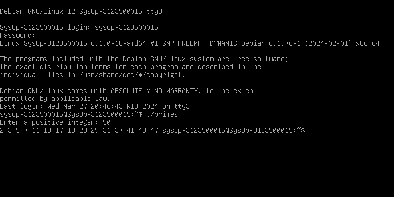
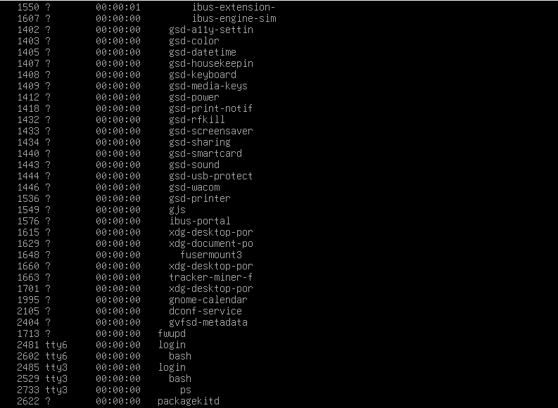
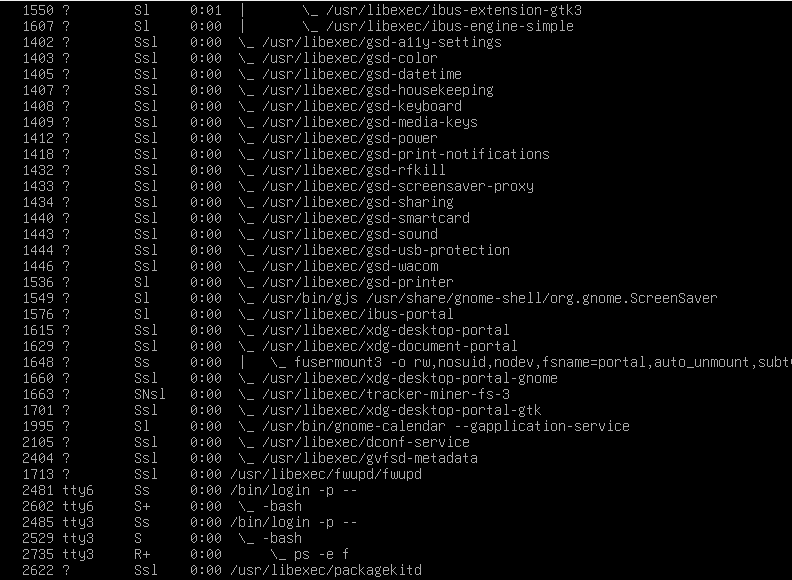
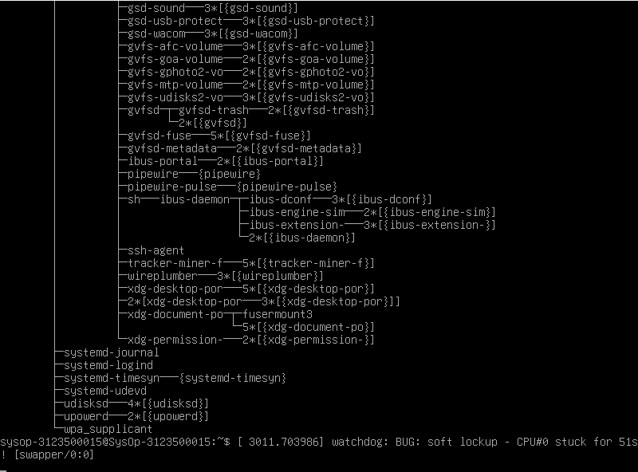
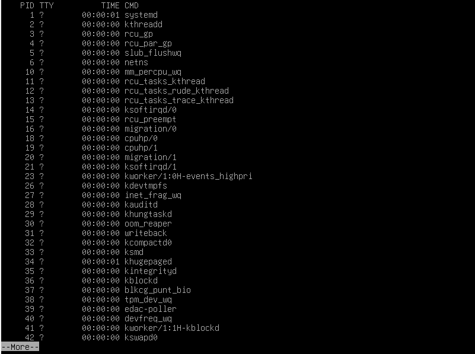
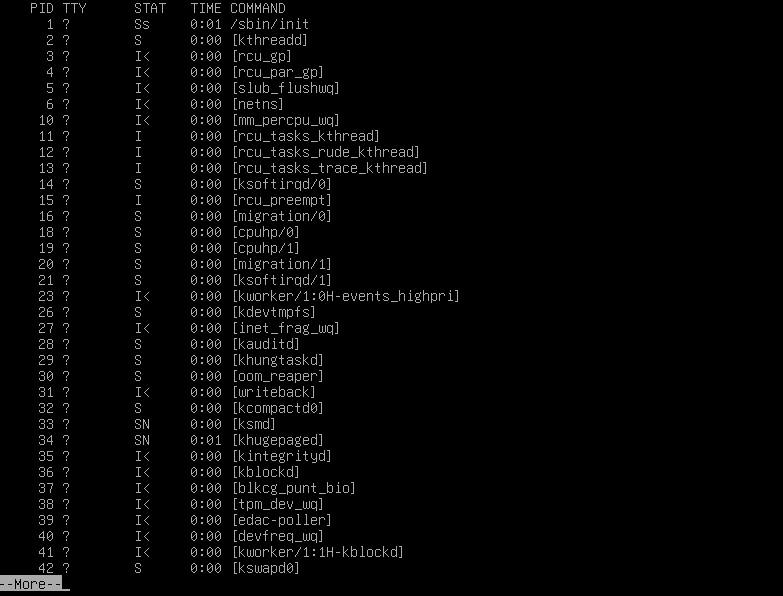
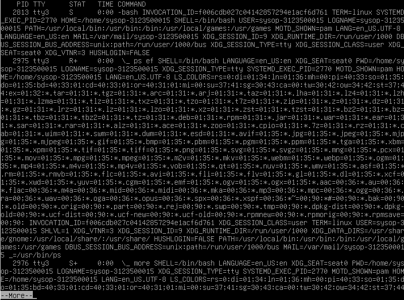
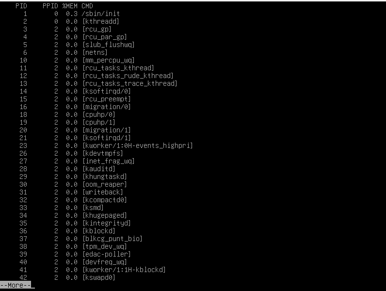

<div align="center">
  <h1 style="text-align: center;font-weight: bold">Praktikum 5<br>Praktek Sistem Operasi</h1>
  <h4 style="text-align: center;">Dosen Pengampu : Dr. Ferry Astika Saputra, S.T., M.Sc.</h4>
</div>
<br />
<div align="center">
  
  <h3 style="text-align: center;">Disusun Oleh :</h3>
  <p style="text-align: center;">
    <strong>Calvin Raditya Sandy Winarto (3123500009)</strong><br>
    <strong>Zada Devi Mariama (3123500015)</strong>
  </p>

<h3 style="text-align: center;line-height: 1.5">Politeknik Elektronika Negeri Surabaya<br>Departemen Teknik Informatika Dan Komputer<br>Program Studi Teknik Informatika<br>2024/2025</h3>
  <hr>
</div>

# Proses dan Manajemen Proses

## POKOK BAHASAN:

* Proses pada Sistem Operasi Linux
* Manajemen Proses pada Sistem Operasi Linux

## TUJUAN PEMBELAJARAN:
Setelah mempelajari materi dalam bab ini, mahasiswa diharapkan mampu:
* Memahami konsep proses pada sistem operasi Linux.
* Menampilkan beberapa cara menampilkan hubungan proses parent dan child.
* Menampilkan status proses dengan beberapa format berbeda.
* Melakukan pengontrolan proses pada shell.
* Memahami penjadwalan prioritas.

  
## DASAR TEORI:

### 1. KONSEP PROSES PADA SISTEM OPERASI LINUX
Proses adalah program yang sedang dieksekusi. Setiap kali menggunakan utilitas sistem atau program aplikasi dari shell, satu atau lebih proses "child" akan dibuat oleh shell sesuai perintah yang diberikan. Setiap kali instruksi diberikan pada Linux shell, maka kernel akan menciptakan sebuah proses-id. Proses ini disebut juga dengan terminology Unix sebagai sebuah Job. Proses Id (PID) dimulai dari 0, yaitu proses INIT, kemudian diikuti oleh proses berikutnya (terdaftar pada /etc/inittab).
Beberapa tipe proses :
##### a. Foreground
   Proses yang diciptakan oleh pemakai langsung pada terminal (interaktif,dialog).
##### b. Batch
   Proses yang dikumpulkan dan dijalankan secara sekuensial (satu persatu). Prose Batch tidak diasosiasikan (berinteraksi) dengan terminal.
#### c. Daemon
Proses yang menunggu permintaan (request) dari proses lainnya dan menjalankan tugas sesuai dengan permintaan tersebut. Bila tidak ada request, maka program ini akan berada dalam kondisi "idle" dan tidak menggunakan waktu hitung CPU.
Umumnya nama proses daemon di UNIX berakhiran d, misalnya inetd, named, popd dil

### 2. SINYAL
Proses dapat mengirim dan menerima sinyal dari dan ke proses lainnya. Proses mengirim sinyal melalui instruksi "kill" dengan format ``kill [-nomor sinyal] PID``

Nomor sinyal: 1 s/d maksimum nomor sinyal yang didefinisikan system
Standar nomor sinyal yang terpenting adalah :
| No Sinyal | Nama | Deskripsi |
| --- | --- | --- |
| 1 | SIGHUP | Hangup, sinyal dikirim bila proses terputus, misalnya melalui putusnya hubungan modem.
| 2 | SIGINT | Sinyal interrupt, melalui ^C
| 3 | SIGQUIT | Sinyal Quit, melalui ^\
| 9 | SIGKILL | Sinyal Kill, menghentikan proses
| 15 | SIGTERM | Sinyal terminasi software 

### 3. MENGIRIM SINYAL
Mengirim sinyal adalah satu alat komunikasi antar proses, yaitu memberitahukan proses yang sedang berjalan bahwa ada sesuatu yang harus dikendalikan. Berdasarkan sinyal yang dikirim ini maka proses dapat bereaksi dan administrator/programmer dapat menentukan reaksi tersebut. Mengirim sinyal menggunakan instruksi
``kill I-nomor sinyall PID``
Sebelum mengirim sinyal PID proses yang akan dikirim harus diketahui terlebih dahulu.

### 4. MENGONTROL PROSES PADA shell
Shell menyediakan fasilitas job control yang memungkinkan mengontrol beberapa job atau proses yang sedang berjalan pada waktu yang sama. Misanya bila melakukan pengeditan file teks dan ingin melakukan interrupt pengeditan untuk mengerjakan hal lainnya. Bila selesai, dapat kembali (switch) ke editor dan melakukan pengeditan file teks kembali.
Job bekerja pada foreground atau background. Pada foreground hanya diper untukkan untuk satu job pada satu waktu. Job pada foreground akan mengontrol shell - menerima input dari keyboard dan mengirim output ke layar. Job pada background tidak menerima input dari terminal, biasanya berjalan tanpa memerlukan interaksi.
Job pada foreground kemungkinan dihentikan sementara (suspend), dengan menekan [Ctr-Z]. Job yang dihentikan sementara dapat dijalankan kembali pada foreground atau background sesuai keperluan dengan menekan "fg" atau "bg". Sebagai catatan, menghentikan job sementara sangat berbeda dengan melakuakan interrupt job (biasanya menggunakan [CtrIC]), dimana job yang diinterrup akan dimatikan secara permanen dan tidak dapat dijalankan lagi.

### 5. MENGONTROL PROSES LAIN 
Perintah ps dapat digunakan untuk menunjukkan semua proses yang sedang berjalan pada mesin (bukan hanya proses pada shell saat ini) dengan format :
``ps -fae`` atau ``ps -aux``
Beberapa versi UNIX mempunyai utilitas sistem yang disebut ``top`` yang menyediakan cara interaktif untuk memonitor aktifitas sistem. Statistik secara detail dengan proses yang berjalan ditampilkan dan secara terus-menerus di refresh. Proses ditampilkan secara terurut dari utilitas CPU. Kunci yang berguna pada ``top`` adalah

``s``- set update frequency
``u`` - display proses dari satu user
``k`` - kill proses (dengan PID)
``a``- quit

Utilitas untuk melakukan pengontrolan proses dapat ditemukan pada sistem
UNIX adalah perintah ``killall``. Perintah ini akan menghentikan proses sesuai PID atau job number proses.

## TUGAS PENDAHULUAN :
Jawablah pertanyaan pertanyaan di bawah ini :
1. Apa yang dimaksud dengan proses ?
* Proses adalah program yang sedang dieksekusi.
* Proses adalah cara atau keadaan yang menghasilkan perubahan dari input menjadi output.
2. Apa yang dimaksud perintah untuk menampilkan status proses :
``ps``, ``pstree``.
* Perintah ‘ps’ adalah aplikasi di Linux yang digunakan untuk menampilkan aktif proses yang berjalan pada sistem. Aplikasi ini dapat digunakan juntuk melakukan manajemen proses Linux.
* Perintah ‘pstree’ adalah perintah pada Linux yang menampilkan pohon proses yang sedang berjalan. Perintah ini digunakan sebagai alternatif visual dari perintah ps

3. Sebutkan opsi yang dapat diberikan pada perintah ps
``-e``	Digunakan untuk menampilkan semua proses.
``-C``	Digunakan untuk menyaring proses berdasarkan nama/perintah.
``-f``	Digunakan untuk menampilkan semua informasi proses secara lengkap.
``-r``	Digunakan untuk menampilkan proses yang sedang berjalan.
``-u``	Digunakan untuk menampilkan proses pada user tertentu saja. Biasanya diikuti dengan menggunakan nama user yang ingin dilihat prosesnya.
``-o``	Digunakan untuk menampilkan proses yang menggunakan kata kunci tertentu saja.
``–pid``	Digunakan untuk menampilkan informasi proses berdasarkan Process ID (PID).
``–ppid``	Digunakan untuk menampilkan informasi proses berdasarkan Parent Process ID (PPID).

4. Apa yang dimaksud dengan sinyal ? Apa perintah untuk mengirim sinyal ?
* Sinyal adalah data atau informasi yang sudah mengalami beberapa proses sedemikian rupa hingga akhirnya menjadi sebuah informasi matang untuk dikirim ke pihak penerima melalui suatu saluran transmisi.
* Perintah untuk  mengirim sinyal  melalui instruksi “kill” dengan format ``Kill [-nomor sinyal] PID``.

5. Apa yang dimaksud dengan proses foreground dan background pada job control ?
* Job pada foreground hanya diperuntukkan untuk satu job pada satu waktu. Job pada foreground akan mengontrol shell-menerima input dari keyboard dan mengirim output ke layer. Sedangkan job pada background tidak menerima input dari terminal, biasanya berjalan tanpa memerlukan interaksi. 

6. Apa yang dimaksud perintah-perintah penjadwalan prioritas :
``top``, ``nice``, ``renice``.
* ``top`` : Memonitor aktivitas sistem.
* ``nice`` : Mengubah prioritas pada sistem.
* ``renice`` : Mengurangi prioritas pada sistem.

## PERCOBAAN :
1. Login sebagai user.
   
   
3. Download program C+ untuk menampilkan bilangan prima yang bernama primes.
   
   
5. Lakukan percobaan percobaan di bawah ini kemudian analisa hasil percobaan.
6. Selesaikan soal-soal latihan

### Percobaan 1: Status Proses
6. Pindah ke command line terminal (tty2) dengan menekan CtrI+Alt+F2 dan login ke terminal sebagai user.
   
7. Instruksi ps (process status) digunakan untuk melihat kondisi proses yang ada. PID adalah Nomor Identitas Proses, TTY adalah nama terminal dimana proses 
   tersebut aktif, STAT berisi S (Sleeping) dan R (Running), COMMAND merupakan instruksi yang digunakan.
    ```
    $ ps
    ```
    
9. Untuk melihat faktor/elemen lainnya, gunakan option -u (user). %CPU adalah presentasi CPU time yang digunakan oleh proses tersebut, %MEM adalah 
   presentasi system memori yang digunakan proses, SIZE adalah jumlah memori yang digunakan, RSS (Real System Storage) adalah jumlah memori yang digunakan, 
   START adalah kapan proses tersebut diaktifkan 
   ```
   $ ps -u
   ```
   
11. Mencari proses yang spesifik pemakai. Proses diatas hanya terbatas pada proses milik pemakai, dimana pemakai teresbut melakukan login
    ```
    $ ps -u ‹user›
    ```
    
13. Mencari proses lainnya gunakan opsi a (all) dan au (all user)
    ```
    $ ps -a
    ``` 
    ```
    $ ps -au
    ```
    
    
15. Logout dan tekan Alt+F7 untuk kembali ke mode grafis
    
### Percobaan 2: Menampilkan Hubungan Proses Parent dan child
11. Pindah ke command line terminal (tty2) dengan menekan CtrI+Alt+F2 dan login ke terminal sebagai user.
    
12. Ketik ps -eH dan tekan Enter. Opsi e memilih semua proses dan opsi H menghasilkan tampilan proses secara hierarki. Proses child muncul dibawah proses 
    parent. Proses child ditandai dengan awalan beberapa spasi.
    ```
    $ ps -eH
    ```
    
14. Ketik ps -e f dan tekan Enter. Tampilan serupa dengan langkah 2. Opsi -f akan menampilkan status proses dengan karakter grafis (\dan _)
    ```
    $ ps -e f
    ```
    
16. Ketik pstree dan tekan Enter Akan ditampilkan semua proses pada sistem dalam bentuk hirarki parent/child. Proses parent di sebelah kiri proses child. 
    Sebagai contoh proses init sebagai parent (ancestor) dari semua proses pada sistem. Beberapa child dari init mempunyai child. Proses login mempunyai 
    proses bash sebagai child. Proses bash mempunyai proses child startx. Proses startx mempunyai child init dan seterusnya.
    ```
    $ pstree
    ```
    
18. Ketik pstree | grep mingetty dan tekan Enter. Akan menampilkan semua proses mingetty yang berjalan pada system yang berupa console virtual. Selain 
    menampikan semua proses, proses dikelompokkan dalam satu baris dengan suatu angka sebagai jumlah proses yang berjalan.
    ```
    $ pstree | grep mingetty
    ```
    
    
20. Untuk melihat semua PID untuk proses gunakan opsi -p.
    ```
    $ pstree -p
    ```
    
22. Untuk menampilkan proses dan ancestor yang tercetak tebal gunakan opsi
    -h.
    ```
    $ pstree -h
    ```
    

## Percobaan 3: Menampilkan Status Proses dengan Berbagai Format
9. Pindah ke command line terminal (tty2) dengan menekan CtrI+Alt+F2 dan login ke terminal sebagai user.
   
10. Ketik ps e | more dan tekan Enter. Opsi -e menampilkan semua proses dalam bentuk 4 kolom : PID, TTY, TIME dan CMD. 
    ```
    $ ps -el more
    ```
    
    
    Jika halaman penuh terlihat prompt --More -- di bagian bawah screen, tekan q untuk kembali ke prompt perintah.
12. Ketik ps ax | more dan tekan Enter. Opsi a akan menampilkan semua proses yang dihasilkan terminal (TTY). Opsi x menampilkan semua proses yang tidak 
    dihasilkan terminal. Secara logika opsi ini sama dengan opsi -e.
    Terdapat 5 kolom : PID, TTY, STAT, TIME dan COMMAND. 
    ```
    $ ps ax | more
    ```
    
    
    Jika halaman penuh terlihat prompt --More -- di bagian bawah screen, tekan q untuk kembali ke prompt perintah.
14. Ketik ps -ef | more dan tekan Enter. Opsi -ef akan menampilkan semua proses dalam format daftar penuh.
    ```
    $ ps ef | more
    ```
    
    
    Jika halaman penuh terlihat prompt --More-- di bagian bawah screen, tekan q untuk kembali ke prompt perintah.
16. Ketik ps -eo pid, cmd | more dan tekan Enter. Opsi -eo akan menampilkan semua proses dalam format sesuai definisi user yaitu terdiri dari kolom PID
    dan CMD.
    ```
    $ ps -eo pid, cmd | more
    ```
    
    
    Jika halaman penuh erlihat prompt --More -- di bagian bawah screen, tekan q untuk kembali ke prompt perintah.
20. Ketik ps -eo pid,ppid,%mem,cmd | more dan tekan Enter. Akan menampilkan kolom PID, PPID dan %MEM. PPID adalah proses ID dari proses parent. %MEM 
    menampilkan persentasi memory system yang digunakan proses. Jika proses hanya menggunakan sedikit memory system akan ditampilkan 0.
    ```
    $ ps -eo pid, ppid, %mem, cmd | more
    ```
    
21. Logout dan tekan Alt+ F7 untuk kembali ke mode grafis
    

## Percobaan 4: Mengontrol proses pada shell

1. Pindah ke command line terminal (ty2) dengan menekan CtrI+Alt+F2 dan login ke terminal sebagai user.
   
2. Gunakan perintah yes yang mengirim output y yang tidak pernah berhenti
   ```
   $ yes
   ```
   
   
   Untuk menghentikannya gunakan CtrI-C.
4. Belokkan standart output ke / dev/null
   ```
   $ yes > /dev/null
   ```
   
   
   Untuk menghentikannya gunakan CtrI-C.
6. Salah satu cara agar perintah yes tetap dijalankan tetapi shell tetap digunakan untuk hal yang lain dengan meletakkan proses pada background dengan 
   menambahkan karakter & pada akhir perintah.
   ```
   $ yes > /dev/null &
   ```
   
   
   Angka dalam "[]" merupakan job number diikuti PID.
8. Untuk melihat status proses gunakan perintah jobs.
   ```
   $ jobs
   ```
   

### Referensi: 
- Sistem: Pengertian Para Ahli, Karakteristik, Elemen, dan Jenisnya (kompas.com) 
- Sistem Operasi: Pengertian Proses dalam Sistem Operasi (sistem-operasi-universitas.blogspot.com)
- Manajemen Proses Linux dengan Command Line - Niagahoster 
