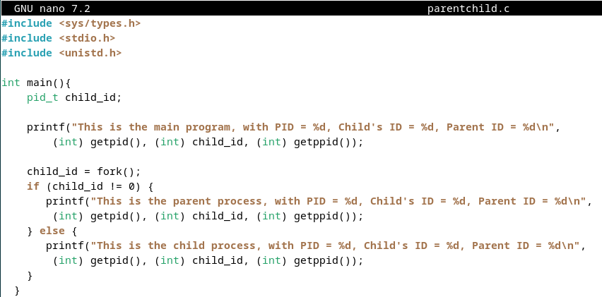

<div align="center">
  <h1 style="text-align: center;font-weight: bold">Tugas UTS<br>Praktek Sistem Operasi</h1>
  <h4 style="text-align: center;">Dosen Pengampu : Dr. Ferry Astika Saputra, S.T., M.Sc.</h4>
</div>
<br />
<div align="center">
  
  <h3 style="text-align: center;">Disusun Oleh :</h3>
  <p style="text-align: center;">
    <strong>Calvin Raditya Sandy Winarto (3123500009)</strong><br>
    <strong>Zada Devi Mariama (3123500015)</strong>
  </p>

<h3 style="text-align: center;line-height: 1.5">Politeknik Elektronika Negeri Surabaya<br>Departemen Teknik Informatika Dan Komputer<br>Program Studi Teknik Informatika<br>2024/2025</h3>
  <hr>
</div>

# Process - Fork - Multithread
Setiap program atau bagian dari program yang sedang dieksekusi oleh CPU disebut dengan proses. Proses dapat berjalan secara _foreground_ atau _background_. 

Untuk melihat seluruh proses yang sedang berjalan gunakan perintah `$ ps -e` .
Bisa juga menggunakan perintah `$pstree | more` untuk melihat secara detil proses yang sefan berjalan dengan format **tree**.

Setiap proses akan memilik **PID**  (Process ID). Apabila dibutuhkan Sebuah proses bisa memiliki proses anakan. Dalam hubungan tersebut proses dapat diibaratkan seperti orang tua (_parent_) dengan anak (_child_) yang turun temurun.
- Setiap proses memiliki parent dan child.
- Setiap proses memiliki ID (_pid_) dan parent ID (_ppid_), kecuali proses `init` atau `systemd`.
- _ppid_ dari sebuah proses adalah ID dari parent proses tersebut. 

```mermaid
classDiagram
      Parent_Process --|> Child_Process
      Parent_Process : PID =4900
      Parent_Process : PPID = 4
      Parent_Process: bash
      class Child_Process{
          PID=4901
          PPID = 4900
          fork01
      }
   ```

   Perhatikan, ppid dari proses `fork01` adalah pid dari proses `bash`.

**fork** digunakan untuk menduplikasi proses. Proses yang baru disebut dengan child proses, sedangkan proses pemanggil disebut dengan parent proses. Spesifikasi fork bisa dilihat dengan `$ man 2 fork`. 
```
int main() { 
                            pid: 2308, ppid: 10 
                             [Main process]
                                 |
  fork();              > Child process created <
                                 +
                               /   \
                             /       \
               pid: 2308, ppid: 10    pid: 30, ppid: 2308
                [Parent Process]    [Child Process]

  return 0;
}
```
perhatikan bahwa :
- `pid` Parent Process == `ppid` Child
- `child_id` Parent Process == `pid` Child Process

**Exec** adalah function yang digunakan untuk menjalankan program baru dan mengganti program yang sedang berlangsung. `exec` adalah program family yang memiliki berbagai fungsi variasi, yaitu `execvp`, `execlp`, `execv`, dan lain lain.

**wait** adalah function yang digunakan untuk mendapatkan informasi ketika child proses berganti _state_-nya. Pergantian state dapat berupa _termination_, _resume_, atau _stop_.

Manual: `$ man 3 exec`

## 1. Fork : Parent - Child Process
* Buat tulisan tentang konsep fork dan implementasinya dengan menggunakan bahasa pemrograman C! (minimal 2 paragraf disertai dengan gambar)
  
  - Fork, pemanggilan sistem untuk membuat proses baru. Fork membuat proses baru dengan menduplikasi proses yang dipanggil. Proses baru ini disebut juga sebagai proses anak (child process). Proses pemanggil yang membuat proses baru disebut sebagai proses induk (parent process). Proses baru (child process) adalah salinan persis dari proses pemanggil (parent process).
    
    Child process dan parent process berjalan di ruang memori yang terpisah. Pada saat fork, kedua ruang memori tersebut memiliki isi yang sama. Penulisan memori, pemetaan file, dan penghapusan pemetaan yang dilakukan oleh salah satu proses tidak mempengaruhi proses lainnya.

     

     

     

     Program diatas merupakan program C yang mengaplikasikan proses fork().  Fungsi main dimulai dengan mencetak ID proses (PID) dari program utama, ID child ( belum diinisialisasi), dan ID parent (ID dari proses saat ini). Kemudian memanggil fork(), yang membuat proses child baru. Pada proses parent, fork() mengembalikan PID child, sementara pada proses child, ia mengembalikan 0. Dengan demikian, program dapat membedakan antara proses parent dan child. Jika proses tersebut adalah parent (yaitu, child_id bukan 0), maka proses tersebut akan mencetak informasi yang sama lagi, tetapi dengan ID child yang sebenarnya.

* Akses dan clonning repo : https://github.com/ferryastika/operatingsystem.git

* Deskripsikan dan visualisasikan pohon proses hasil eksekusi dari kode program ``fork01.c``, ``fork02.c``, ``fork03.c``, ``fork04.c``, ``fork05.c``dan ``fork06.c``.


1. ``fork01.c``


 ```
       int main() {
  for(int i = 0;i < 3; i++){
    PID : 4010, PPID : 3888, uid : 1000
              [Main Process]
                    |
                sleep(3)
                    |
    PID : 4010, PPID : 3888, uid : 1000
              [Main Process]
                    |
                sleep(3)
                    |
    PID : 4010, PPID : 3888, uid : 1000
              [Main Process]
                    |
                sleep(3)
       }
    }
 ```
Output dari program menunjukkan bahwa proses tersebut (disebut proses "I am process 4010") memiliki ID 4010 dan parent process memiliki ID 3888. Selain itu, proses ini dimiliki oleh pengguna dengan ID 1000. Dari output tersebut, dapat disimpulkan bahwa program ini menggunakan sistem panggilan seperti `getpid()`, `getppid()`, dan `getuid()` untuk mendapatkan informasi tentang proses yang sedang berjalan, parent process, dan pemiliknya. Program kemudian menunggu selama 3 detik sebelum mengulangi proses tersebut.

  2. ``fork02.c``

 

 

```
 int main() {
  fork();         > Child process created <
                              +
                            /   \
                          /       \
                        /           \
  while(1){           /               \
          PID: 4016, PPID: -       PID: 4016, PPID: 4016
          [Parent Process]          [Child Process]
                      \               /
                        \           /
                          \       /
                            \   /
                              |
                          sleep(2)
                              |
                             x++
  }
}
```
Dari output program, terlihat bahwa child process memiliki PID yang berbeda dari parent process, dan keduanya berjalan secara bersamaan. Kedua proses terus mencetak nilai `x` yang meningkat. Karena tidak ada kondisi berhenti dalam loop, program akan berjalan tanpa henti sampai dihentikan secara paksa.

  3. ``fork03.c``


```
int main() {
      fork();         > Child Process created <
                              +
                            /   \
                          /       \
  x=5;                  /           \
  while(x<=5){        /               \
          PID: 4047, PPID: -      PID: 4048, PPID: 4047
          [Parent Process]          [Child Process]
                      \               /
                        \           /
                          \       /
                            \   /
                              |
                          sleep(2)
                              |
                            x++
  }
}
```
Output program menunjukkan bahwa terdapat dua proses yang berjalan: parent proces dan child process. Child process memiliki PID yang berbeda dari parent process, namun keduanya melakukan hal yang sama, yaitu mencetak PID mereka sendiri secara bergantian setiap 2 detik.
  
  4. ``fork04.c``


```
int main() {
  fork();               > Child process created <
                                    +
                                  /   \
                                 /     \
                                /       \
                               /         \
                    PID: 4054, PPID: -   \
                    [Parent Process]       \
                            |               \
                            |                \
                            |        PID: 4055, PPID: 4054
                          wait         [Child Process]
                            \                /
                              \            /
                                \        /
                                  \    /
                                    \/
                                   exit
}
```
Output dari program menunjukkan bahwa parent process pertama kali berjalan, mencetak PID-nya sendiri dan PID anaknya. Kemudian, child process berjalan, mencetak PID-nya sendiri dan PID pparent process. Program ini mengilustrasikan cara menggunakan `fork()` untuk menciptakan proses baru, serta cara parent process dan child process berinteraksi dan menunggu satu sama lain untuk menyelesaikan tugasnya.

  5. ``fork05.c``


```
int main() {
  fork();                > Child process created <
                                    +
                                  /   \
                                /       \
                PID : 4061 PPID : -      \
                 [Parent Process]           \
                        |                     \
                        |                       \
                        |               PID : 4062 PPID : 4061
                      wait                    execl(/bin/ls)
                        \                     [Child Process]
                          \                       /
                            \                   /
                              \               /
                                \           /
                                  \       /
                                    \   /
                                      |
                                    exit
}
```
Output program menunjukkan bahwa parent process mencetak PID-nya sendiri dan PID child process. Kemudian, child process menjalankan perintah ls -l /home, yang mencetak daftar isi dari direktori /home dengan detail. Setelah itu, parent process mencetak pesan bahwa dia akan menunggu child process. Setelah child process selesai, parent process keluar dan mencetak pesan bahwa dia juga akan berhenti.

  6. ``fork06.c``


```
int main() {
  fork();           > Child process created <
                                +
                              /   \
                            /      \
              PID: 4069, PPID: -   \
              [Parent Process]       \
                      |               \
                      |          PID: 4070, PPID: 4069
                    wait          [Child Process]
                      \               /
                        \           /
                          \       /
                            \   /
                              |
                            exit
}
```
Output program menunjukkan bahwa parent process mencetak PID-nya sendiri dan PID child process. Kemudian, child process mencetak PID-nya sendiri. Namun, setelah itu, pesan "Could not execl file fork3" dicetak, yang menunjukkan bahwa execl() gagal. Kemudian, parent process mencetak pesan bahwa dia akan menunggu child proces. Setelah child process selesai, parent process keluar dan mencetak pesan bahwa dia juga akan berhenti.

## 2. Tugas

Buatlah program perkalian 2 matriks [4 x 4] dalam bahasa C yang memanfaatkan ``fork()``.


Program diatas merupakan bentuk penggunaan proses fork dalam bahasa pemrograman C untuk melakukan perkalian matriks. Dua matriks yaitu `matrix1` dan `matrix2` yang masing-masing berukuran 4x4 didefinisikan. Di dalam fungsi `main`, terdapat pemanggilan `fork()` yang membuat duplikat proses saat ini. Hasil dari pemanggilan  disimpan dalam variabel `pid`. Jika `pid` bukan nol,  berarti proses saat ini adalah proses induk (parent), sedangkan jika `pid` adalah nol, itu berarti proses saat ini adalah proses anak (child). Jika `pid` tidak nol, proses induk menunggu proses anak selesai dengan memanggil `wait(NULL)`. Setelah proses anak selesai, proses induk melakukan perkalian matriks menggunakan fungsi `multiply` dan mencetak hasilnya bersama dengan informasi tentang proses. Jika `pid` adalah nol, itu berarti proses ini adalah proses anak. Proses anak mencetak informasi tentang dirinya sendiri dan melakukan perkalian matriks juga.