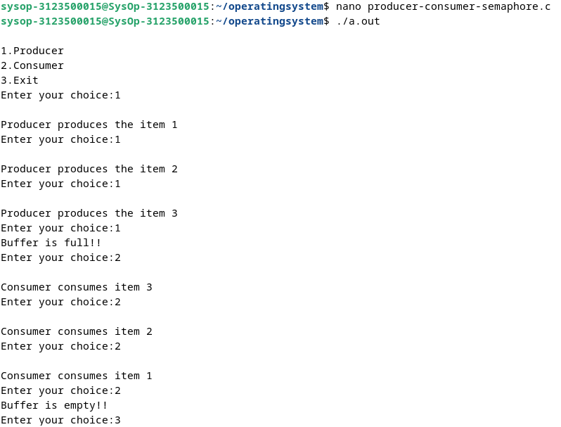
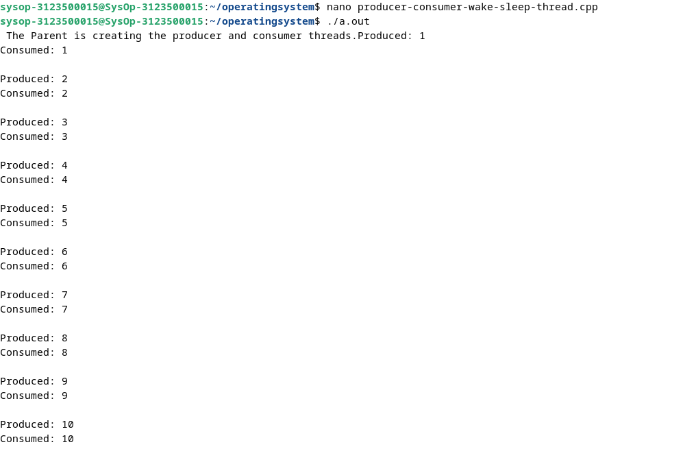

  <h1 style="text-align: center;font-weight: bold">Praktikum 9 Praktek Sistem Operasi</h1>
  <h4 style="text-align: center;">Dosen Pengampu : Dr. Ferry Astika Saputra, S.T., M.Sc.</h4>

 

  
  <h3 style="text-align: center;">Disusun Oleh :</h3>
  

    <strong>Calvin Raditya Sandy Winarto (3123500009)</strong> 
    <strong>Zada Devi Mariama (3123500015)</strong>

<h3 style="text-align: center;line-height: 1.5">Politeknik Elektronika Negeri Surabaya Departemen Teknik Informatika Dan Komputer Program Studi Teknik Informatika 2024/2025</h3>
  

#
## 1. Producer Consumer Semaphore

  

Analisis : Program diatas merupakan implementasi dari masalah Producer-Consumer semaphore menggunakan Bahasa C. Pada program di atas terdapat dua proses yaitu produsen (producer) dan konsumen (consumer)  yang berinteraksi dengan sebuah buffer berukuran tetap menggunakan semaphore untuk sinkronisasi. Tugas produsen adalah menghasilkan item dan menempatkannya di buffer. Sedangkan tugas konsumen adalah menghapus item dari buffer dan mengonsumsinya. Program ini memastikan bahwa produsen tidak dapat menambahkan item ke buffer jika buffer penuh, dan konsumen tidak dapat mengeluarkan item dari buffer jika buffer kosong. Penggunaan semaphore memastikan bahwa produsen dan konsumen tidak dapat mengakses buffer secara bersamaan, menghindari kondisi balapan.
## 2. Producer Consumer Wake Sleep Thread

  

Analisis : Program diatas merupakan implementasi masalah Producer-Consumer menggunakan thread dan kondisi variabel di C++. Program ini menampilkan solusi untuk masalah Producer-Consumer dengan menggunakan thread, mutex, dan variabel kondisi untuk mengatur sinkronisasi antara produsen dan konsumen. Mutex, digunakan untuk memastikan bahwa hanya satu thread yang dapat mengakses atau memodifikasi variabel global pada satu waktu. Sementara variabel kondisi, digunakan untuk mengatur komunikasi antara produsen dan konsumen. Output program menunjukkan bahwa produsen menghasilkan item dan konsumen mengkonsumsi item tersebut secara bergantian. Penggunaan mutex dan variabel kondisi memastikan bahwa tidak ada kondisi balapan yang terjadi, dan produsen serta konsumen berjalan sinkron. 
 

